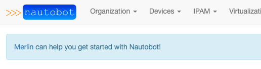
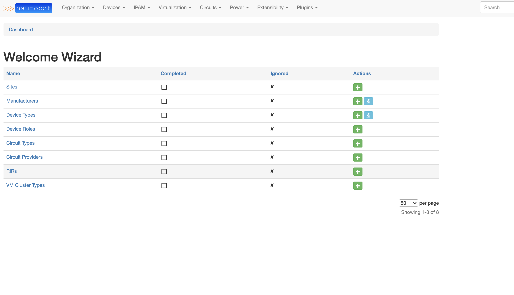
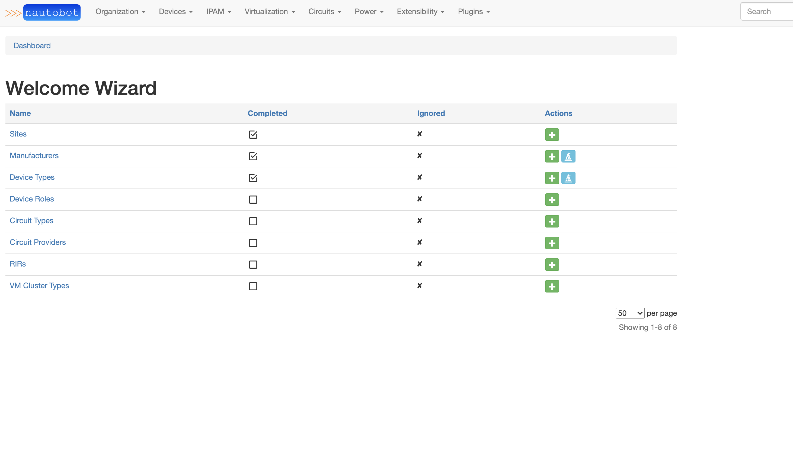
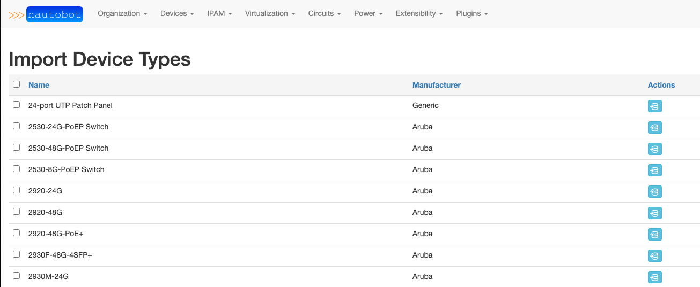

# Welcome Wizard

[](https://github.com/ambv/black)


A plugin for [Nautobot](https://github.com/nautobot/nautobot).


## Overview

The Welcome Wizard is an open-source Nautobot Plugin with the goal to assist users with the necessary initial steps in populating data within Nautobot.

The Welcome Wizard adds four (4) key features:

### Import Wizard

Welcome Wizard uses the `Import Wizard` to allow ease of adding community defined Device Types and Manufacturers into Nautobot. This is built upon the [git datasources](https://nautobot.readthedocs.io/en/stable/user-guides/git-data-source/#git-as-a-data-source) feature of Nautobot.

### Quick-Start Settings

Welcome Wizard includes by default the [DeviceType-library](https://github.com/netbox-community/devicetype-library), but this can be disabled and a custom library can be used instead.

### Helpful Middleware

Welcome Wizard includes banners in forms to alert the user when required form fields have no associated resources in Nautobot.

### Welcome Wizard Dashboard

The Welcome Wizard Dashboard contains a list of common Nautobot Data Models that many other Nautobot models require. This page allows ease of adding items to Nautobot or, if supported, importing them. This ties all of the features together.1

## Installation

Installing the Nautobot Welcome Wizard follows the [Plugin Installation](https://nautobot.readthedocs.io/en/stable/plugins/#installing-plugins).

The plugin is available as a Python package in pypi and can be installed with pip

```shell
pip install nautobot-welcome-wizard
```

> The plugin is compatible with Nautobot 1.0.0b4 and higher

To ensure Welcome Wizard is automatically re-installed during future upgrades, create a file named `local_requirements.txt` (if not already existing) in the Nautobot root directory (alongside `requirements.txt`) and list the `nautobot-welcome-wizard` package:

```no-highlight
# echo nautobot-welcome-wizard >> local_requirements.txt
```

Once installed, the plugin needs to be enabled in your `nautobot_config.py`

```python
# In your nautobot_config.py
PLUGINS = ["welcome_wizard"]

# PLUGINS_CONFIG = {
#   "welcome_wizard": {
#     "enable_devicetype-library": True
#   }
# }
```

The plugin behavior can be controlled with the following list of settings:

- `enable_devicetype-library`: If enabled the [device type](https://github.com/netbox-community/devicetype-library) git repository will be automatically added for you.

After updating nautobot_config.py, you will need to run `nautobot-server migrate` and then reload the nautobot service and the nautobot-worker service.

## Usage

Log in to Nautobot and you will be guided through Banners on the top of the pages.

## Contributing

Pull Requests are welcome and automatically built and tested against multiple versions of Python and Nautobot through TravisCI.

The project is packaged with a light development environment based on `docker-compose` to help with the local development of the project and to run the tests within TravisCI.

The project is following Network to Code's software development guideline and is leveraging:

- Black, Pylint, Bandit and pydocstyle for Python linting and formatting.
- Django unit test to ensure the plugin is working properly.

### Development Environment

The development environment can be used in 2 ways. First, with a local poetry environment if you wish to develop outside of docker, and second, inside of a docker container. The below commands will start the Nautobot server listening on port 8080.

#### Local Poetry Development Environment

1. Copy `development/creds.example.env` to `development/creds.env` (This file will be ignored by git and docker)
2. Uncomment the `POSTGRES_HOST`, `REDIS_HOST`, and `NAUTOBOT_ROOT` variables in `development/creds.env`
3. Create an invoke.yml with the following contents at the root of the repo:

```shell
---
welcome_wizard:
  local: true
  compose_files:
    - "docker-compose.requirements.yml"
```

4. Run the following commands:

```shell
poetry shell
poetry install
export $(cat development/dev.env | xargs)
export $(cat development/creds.env | xargs)
```

5. You can now run nautobot-server commands as you would from the [Nautobot documentation](https://nautobot.readthedocs.io/en/latest/). For example, to start the development server:

```shell
nautobot-server runserver 0.0.0.0:8080 --insecure
```

#### Docker Development Environment

This project is managed by [Python Poetry](https://python-poetry.org/) and has a few requirements to setup your development environment:

1. Install Poetry, see the [Poetry Documentation](https://python-poetry.org/docs/#installation) for your operating system.
2. Install Docker, see the [Docker documentation](https://docs.docker.com/get-docker/) for your operating system.

Once you have Poetry and Docker installed you can run the following commands to install all other development dependencies in an isolated python virtual environment:

```shell
poetry shell
poetry install
invoke start
```

### CLI Helper Commands

The project includes a CLI helper based on [invoke](http://www.pyinvoke.org/) to help setup the development environment. The commands are listed below in 3 categories `dev environment`, `utility` and `testing`.

Each command can be executed with `invoke <command>`. Environment variables `INVOKE_WELCOME_WIZARD_PYTHON_VER` and `INVOKE_WELCOME_WIZARD_NAUTOBOT_VER` may be specified to override the default versions. Each command also has its own help `invoke <command> --help`

#### Docker dev environment

```no-highlight
  build            Build all docker images.
  debug            Start Nautobot and its dependencies in debug mode.
  destroy          Destroy all containers and volumes.
  restart          Restart Nautobot and its dependencies.
  start            Start Nautobot and its dependencies in detached mode.
  stop             Stop Nautobot and its dependencies.
```

#### Utility

```no-highlight
  cli              Launch a bash shell inside the running Nautobot container.
  create-user      Create a new user in django (default: admin), will prompt for password.
  makemigrations   Run Make Migration in Django.
  nbshell          Launch a nbshell session.
```

#### Testing

```no-highlight
  bandit           Run bandit to validate basic static code security analysis.
  black            Run black to check that Python files adhere to its style standards.
  flake8           This will run flake8 for the specified name and Python version.
  pydocstyle       Run pydocstyle to validate docstring formatting adheres to NTC defined standards.
  pylint           Run pylint code analysis.
  tests            Run all tests for this plugin.
  unittest         Run Django unit tests for the plugin.
```

## Questions

For any questions or comments, please check the [FAQ](FAQ.md) first and feel free to swing by the [Network to Code slack channel](https://networktocode.slack.com/) (channel #networktocode).
Sign up [here](https://slack.networktocode.com/)

## Screenshots

  
  
  


