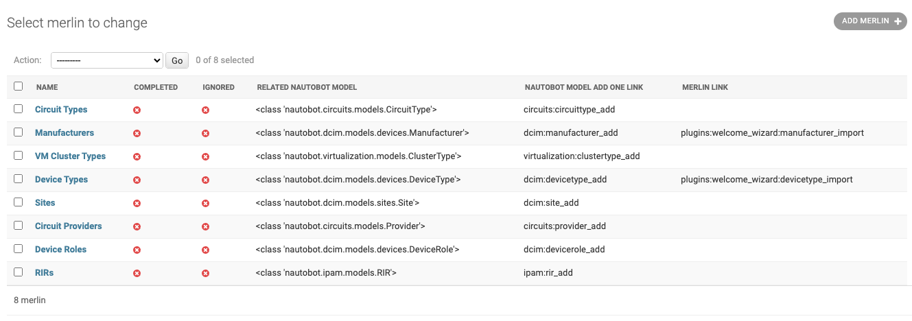

# Welcome Wizard

The Nautobot Welcome Wizard includes a great dashboard to help you get started with Nautobot. One annoyance when using Nautobot is finding item dependencies only after you've filled out half a form. For example, when creating a `device` only to find out you need a `device type`. Then discovering you also need a manufacturer when trying to create the `device type`.

## The Dashboard

This is where the Welcome Wizard Dashboard will help. It is a single location you can visit to find links to common dependencies. If a resource in Nautobot requires another it will be listed here. The `Name` column includes links to view a list of the associated resources. The `Completed` column will show if a resource has been created. The `Ignored` column allows the administrator (through the admin panel) tp mark a dependency as ignored if that resource that will be unused. Finally, the `Actions` column will have two button links. The first is a green plus which will take you to the resource creation form. The blue wizard hat will take you to the [Import Wizard](import_wizard.md) allowing you to import from a git repository.

### Completed Column

The Welcome Wizard automatically tracks the resources in Nautobot. For instance, once you add a `Site` to Nautobot,
the column will update (upon page reload) to show as completed.

### Ignored Column

Tracking fields that are ignored are done through the Django Admin Panel. Log into the admin panel and navigate to `Merlin` under the `Nautobot Welcome Wizard` heading.

Next choose the `Merlin` field you would like to change. You can click on the Name field to edit.

Once selected, check the `Ignored` checkbox and then `Save`. In the example below, we are ignoring the RIRs.

Navigate back to the Getting Started Dashboard to see that your field is marked as ignored.

