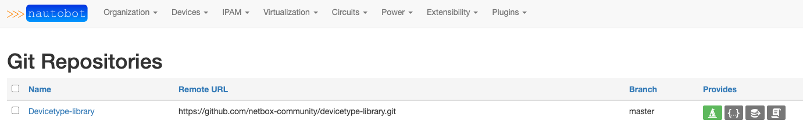

# Import Wizard

## Import Manufacturers

You can browse to the `Import Manufacturers` page to easily import selected manufacturers into Nuatobot.

If the `enable_devicetype-library` setting is choosen, an automatic refresh will happen on page load. You may need to refresh the page in order see the manufacturers.

## Import Device Types

You can browse to the `Import Device Types` page to easily import selected device types into Nuatobot.

## Git Settings

The plugin makes heavy use of the nautobot git data sources feature. This set of instructions will walk an operator through setting up the Import Wizard repository.  

Import Wizard uses the file and folder structure of [devicetype-library](https://github.com/netbox-community/devicetype-library).  Currently Import Wizard looks for a folder in the root directory called `device-types`.  Convention has folders for manufacturers and the device type yaml files underneath the manufacturers folder.  The [readme](https://github.com/netbox-community/devicetype-library/blob/master/README.md) for the [devicetype-library](https://github.com/netbox-community/devicetype-library) goes into the details of what is required in the yaml files.

In order to setup this repository, go to Nautobot and navigate to the Data Sources Git integration. `Extensibility -> Git Repositories`.

From the Git Repositories page we can add the **Import Wizard** repository.

Click on `[+ADD]`.

You will now be presented with a page to fill in the repository details.

Parameters:
|Field|Explanation|
|:--|:--|
|Name|User friendly name for the backup repo.|
|Slug|Auto-generated based on the `name` provided.|
|Remote URL|The URL pointing to the Git repo that stores the backup configuration files. Current git url usage is limited to `http` or `https`.|
|Branch|The branch in the Git repo to use. Defaults to `main`.|
|Token|The token is a personal access token for the `username` provided.  For more information on generating a personal access token. [Github Personal Access Token](https://docs.github.com/en/github/authenticating-to-github/creating-a-personal-access-token)
|Username|The Git username that corresponds with the personal access token above.|
|Provides|Valid providers for Git Repo.|
 

Select `Import Wizard` and click on `[Create]`.

Once you click `[Create]` and the repository syncs, the main page will now show the repo along with its status.

For their respective features, the "Provides" field could be `Import Wizard` and jinja templates.
