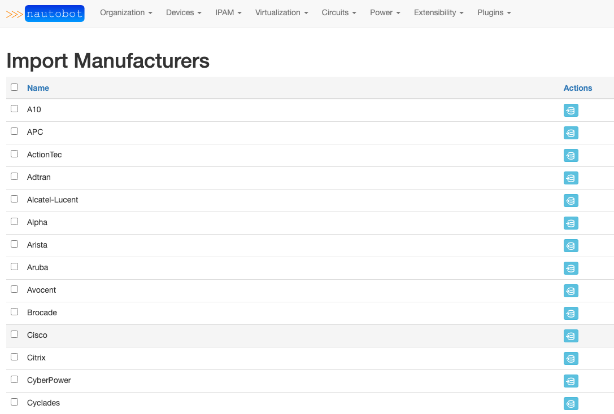
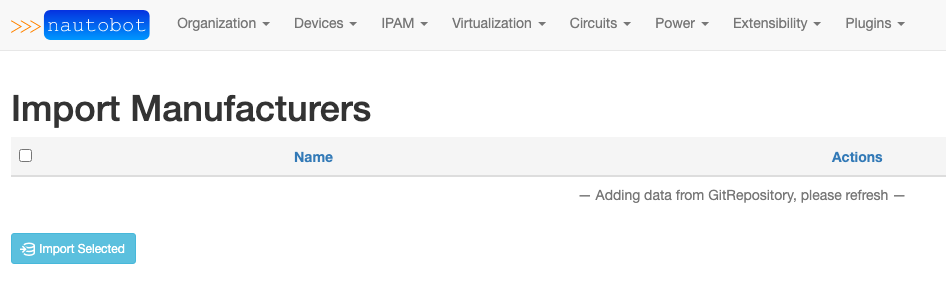
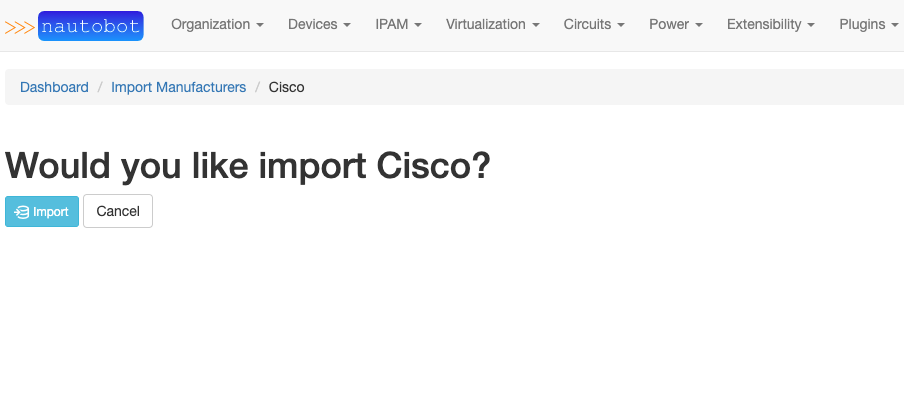
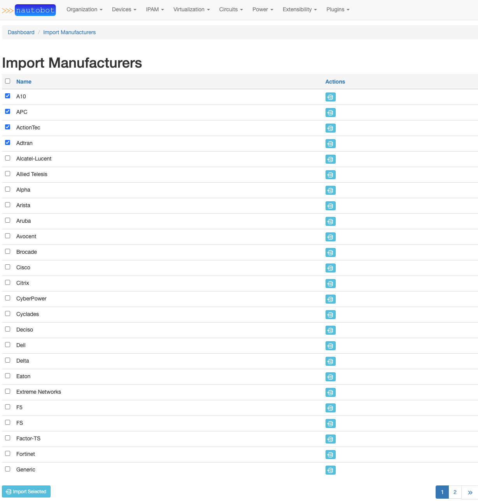
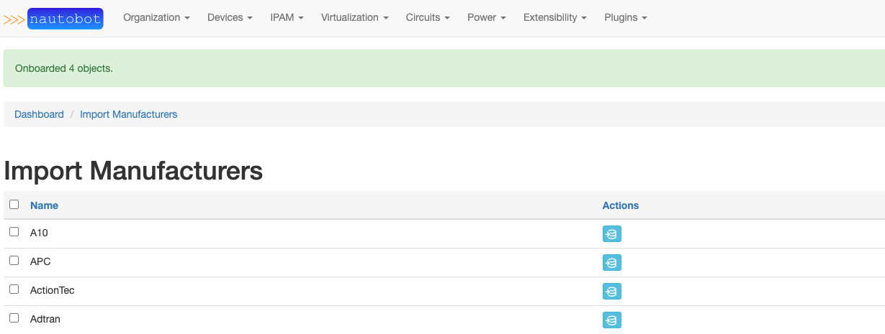
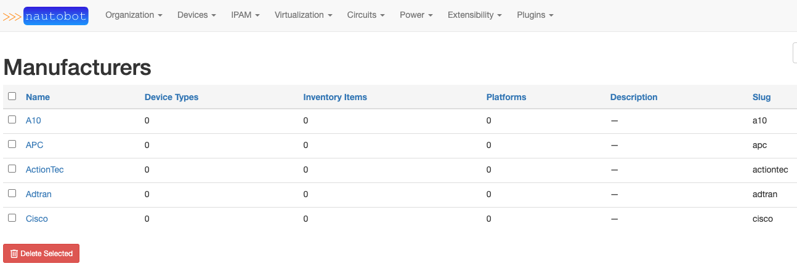
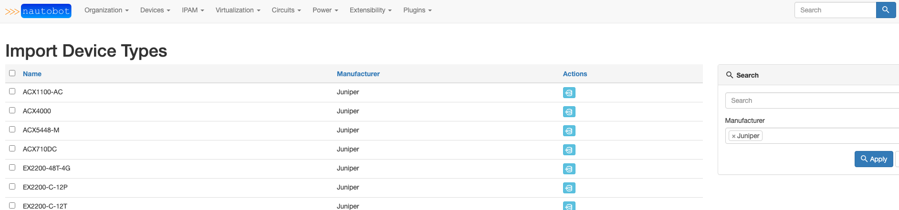

# Import Wizard

## Import Manufacturers

You can browse to the `Import Manufacturers` page to easily import selected manufacturers into Nautobot.

If the `enable_devicetype-library` setting is enabled, an automatic sync of the repository will happen on page load. You may need to refresh the page in order see the manufacturers.

Manufactures on this page are not automatically loaded into Nautobot. This is to keep the Nautobot Manufactures page from being bloated with Manufactures you may not need. Instead, you can choose to import the Manufactures from here. To import a single Manufacturer click on the blue import button in the actions column of the chosen Manufacturer. In the below example we click the import button for Cisco. A confirmation page will load asking to confirm importing the selected Manufacturer. Click `[Import]` to confirm.

Alternatively, you can choose to bulk import Manufacturers. Select the Manufacturers you would like to import by placing a check mark next to their names. Then select the blue `[Import Selected]` button at the bottom of the page.

Navigating to Manufacturers inside Nautobot will confirm these manufacturers were imported.

## Import Device Types

You can browse to the `Import Device Types` page to easily import selected device types into Nautobot.

Importing Device Types happens the same way as Manufacturers. Device Types can also be filtered by Manufacturer by using the search function or the Manufacturer dropdown.

