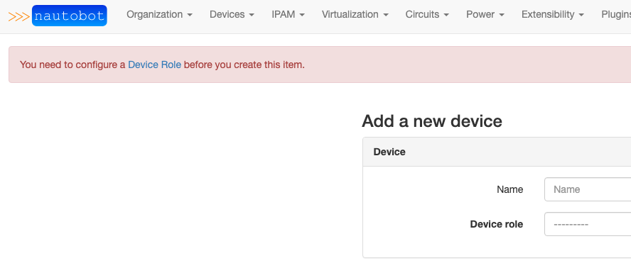

# Welcome Wizard Middleware

The Welcome Wizard plugin comes packed with helpful middleware.

## Homepage Banner

Upon loading the Nautobot Homepage, the Nautobot Welcome Wizard greets you with a message to help guide you to the dashboard.

## Required Fields

The Welcome Wizard checks any Nautobot form for required fields. If a field is required and does not have at least one resource created for that field, it will add a message to the top of the page with a link to add the resource. If multiple required fields have missing resources you will get a message for each missing item.

