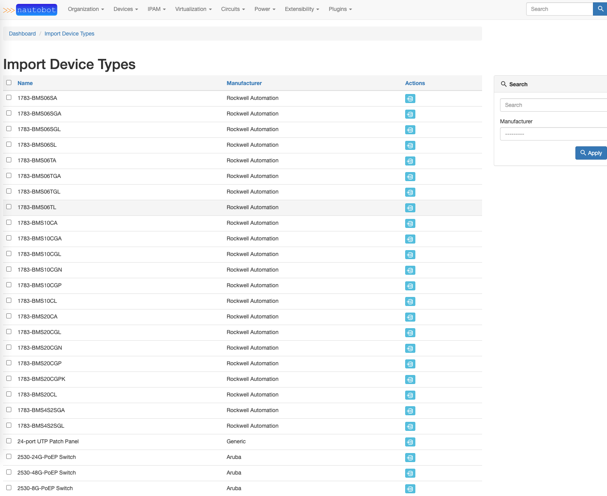

# Getting Started with the App

This document provides a step-by-step tutorial on how to get the App going and how to use it.

## Install the App

To install the App, please follow the instructions detailed in the [Installation Guide](../admin/install.md).

## First steps with the App

Log in to Nautobot and you will be guided through Banners on the top of the pages.

You can also begin by selecting `Plugins -> Nautobot Welcome Wizard -> Welcome Wizard` from the navigation bar (or navigating to `/plugins/welcome_wizard/`) on your Nautobot instance to view the Welcome Wizard dashboard:

You are shown a set of Nautobot objects that lay the groundwork for other Nautobot objects. The goal of the dashboard is to help introduce features of Nautobot and keep track of their use. For instance, Sites are used in a number of objects inside of Nautobot. A Site is used when creating Devices, Racks, and Rack Groups. In addition, they are optional in many other objects.

From the dashboard, you can click on the green Add button in the Sites role to take you directly to the form for adding a Site. For Manufacturers and Device Types, you can click on the blue wizard hat to take you to the Welcome Wizard Import page.

### Import Manufacturers

You can browse to the `Import Manufacturers` page to easily import selected manufacturers into Nautobot.

If the `enable_devicetype-library` setting is enabled, an automatic sync of the repository will happen on page load. You may need to refresh the page in order see the manufacturers.

Manufactures on this page are not automatically loaded into Nautobot. This is to keep the Nautobot Manufactures page from being bloated with Manufactures you may not need. Instead, you can choose to import the Manufactures from here. To import a single Manufacturer click on the blue import button in the actions column of the chosen Manufacturer. In the below example we click the import button for Cisco. A confirmation page will load asking to confirm importing the selected Manufacturer. Click `[Import]` to confirm.

Alternatively, you can choose to bulk import Manufacturers. Select the Manufacturers you would like to import by placing a check mark next to their names. Then select the blue `[Import Selected]` button at the bottom of the page.

Navigating to Manufacturers inside Nautobot will confirm these manufacturers were imported.

### Import Device Types

You can browse to the `Import Device Types` page to easily import selected device types into Nautobot.

Importing Device Types happens the same way as Manufacturers. Device Types can also be filtered by Manufacturer by using the search function or the Manufacturer dropdown.

## What are the next steps?

You can check out the [Use Cases](app_use_cases.md) section for more examples.
