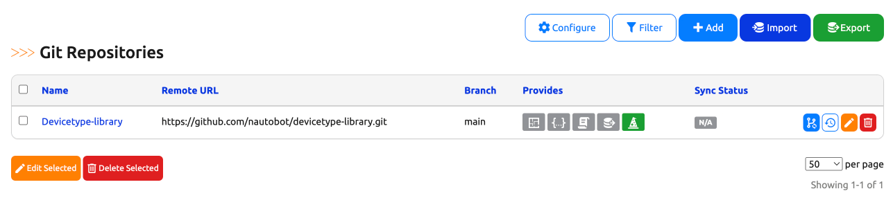
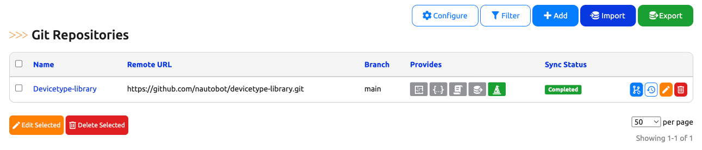

# Git Data Source

The Nautobot Welcome Wizard makes use of the [Git™ as a Data Source](https://docs.nautobot.com/projects/core/en/stable/user-guides/git-data-source/) feature from Nautobot.

## Import Wizard Data Source

This set of instructions will walk an operator through setting up the Import Wizard repository.

Import Wizard uses the file and folder structure of [devicetype-library](https://github.com/netbox-community/devicetype-library). Currently, [Import Wizard](app_getting_started.md#import-manufacturers) looks for a folder in the root directory called `device-types`. Convention has folders for manufacturers and the device type YAML files underneath the manufacturers folder. The [README](https://github.com/netbox-community/devicetype-library/blob/master/README.md) for the [devicetype-library](https://github.com/netbox-community/devicetype-library) goes into the details of what is required in the YAML files.

!!! note
    The [devicetype-library](https://github.com/netbox-community/devicetype-library) is not required to be used. You can swap it with your own repo as long as it follows the same structure.

In order to setup this repository, go to Nautobot and navigate to the Data Sources Git integration: `Extensibility -> Git Repositories`.

From the Git Repositories page we can add the **Import Wizard** repository.

Click on `[+ADD]`.

You will now be presented with a page to fill in the repository details.

|Field|Explanation|
|:---|:---|
|Name|User friendly name for the backup repo.|
|Slug|Auto-generated based on the `name` provided.|
|Remote URL|The URL pointing to the Git repo that stores the device types. Current git url usage is limited to `http` or `https`.|
|Branch|The branch in the Git repo to use. Defaults to `main`.|
|Token|The token is a personal access token for the `username` provided. For more information on generating a personal access token. [Github Personal Access Token](https://docs.github.com/en/github/authenticating-to-github/creating-a-personal-access-token)
|Username|The Git username that corresponds with the personal access token above.|
|Provides|Valid providers for Git Repo.|

Fill out the required information and be sure to select `Import Wizard` on the provided selection. Then click on `[Create]`.

Once you click `[Create]` and the repository syncs, the main page will now show the repo along with its status.

For their respective features, the "Provides" field could be `Import Wizard`.
